# DEV QUIZ

O projeto foi desenvolvido na 5º edição do evento Next Level Week (NLW), oferido pela Rocketseat, realizado entre os dias 19 e 23 de Abril, ao qual eu escolhi seguir a trilha Flutter.

Esta aplicação trata-se de um Quiz, criado por desenvolvedores para desenvolvedores, com objetivo de intensificar os conhecimentos em programação, através dos exercícios propostos pela aplicação, onde tem interatividade de perguntas e respostas, além do estimulo para dar continuidade cada vez mais no aprendizado.

    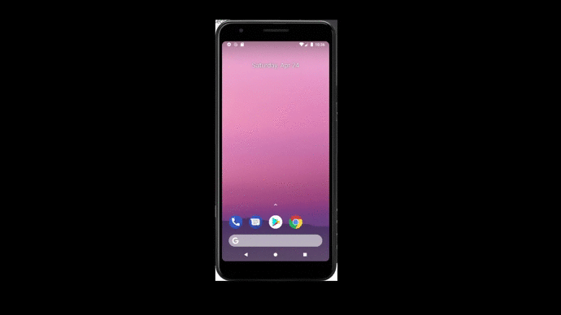

### Protótipo
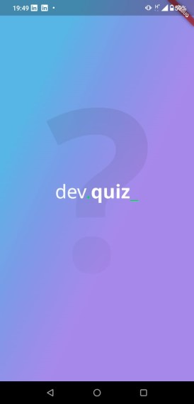
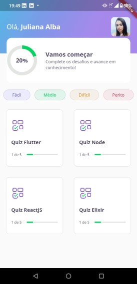
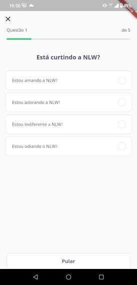
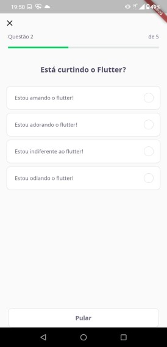
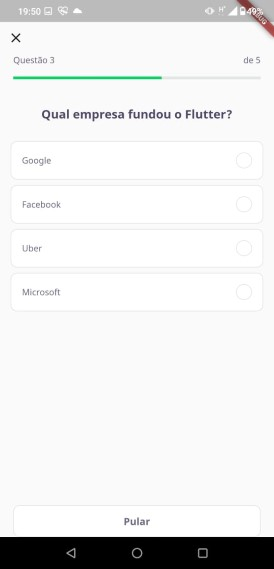
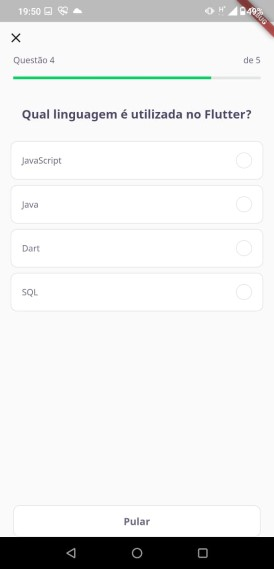
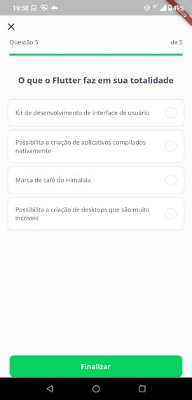
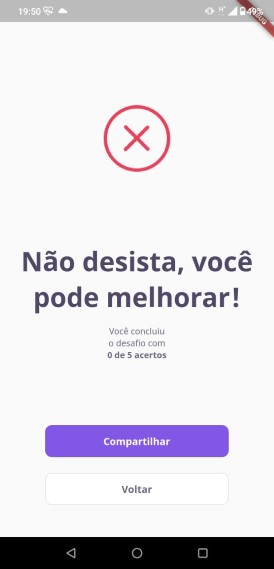
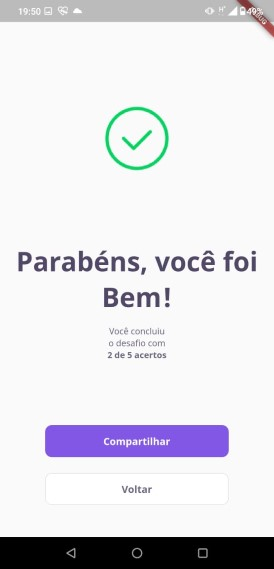
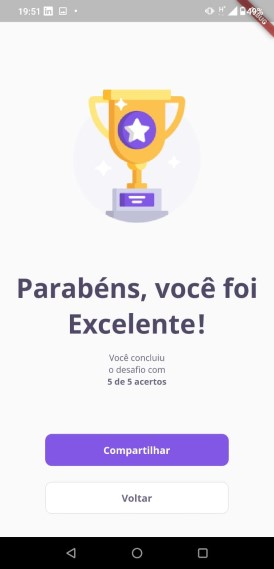

### Clicando na imagem abaixo, é possível realizar o Download do Aplicativo DevQuiz

[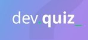](https://github.com/JulianaAlba/DevQuizz-NLW5RocketSeat/blob/master/instalador/app-release.apk?raw=true)

### Desenvolvimento

O desenvolvimento do app foi realizado com a IDE *Android Studio*, Framework *Flutter* e linguagem *Dart*.

### Créditos

Responsável pelo UX/UI no Figma: Tiago Luchtenberg.

Responsável pela orientação no desenvolvimento: Gabriel Sávio.

## Getting Started

This project is a starting point for a Flutter application.

A few resources to get you started if this is your first Flutter project:

- [Lab: Write your first Flutter app](https://flutter.dev/docs/get-started/codelab)
- [Cookbook: Useful Flutter samples](https://flutter.dev/docs/cookbook)

For help getting started with Flutter, view our
[online documentation](https://flutter.dev/docs), which offers tutorials,
samples, guidance on mobile development, and a full API reference.
